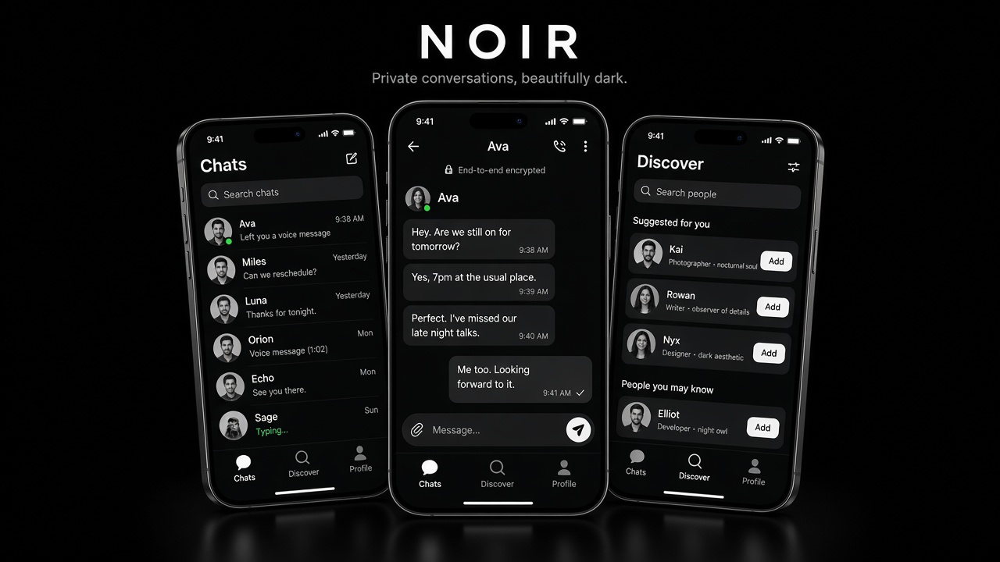

# Noir



**Private conversations, beautifully dark.**

Noir is a minimal, black-themed chat app built with Expo and React Native. Find people, add friends, and chat in real time, with push notifications when you're away.

- **Android APK:** [Download](https://drive.google.com/file/d/1r9Bv2KbvVtFH54ezlZw68csBbx2wdQlm/view?usp=sharing)
- **Backend:** https://github.com/atharvadhumal/noir-backend-chatApp
- **Live API:** https://noir-backend-chatapp.onrender.com

## Features

- **Accounts:** email/password sign-up and sign-in, sessions stored securely on the device
- **Discover:** search people by name or email and send friend requests
- **Friends:** accept, reject or cancel requests, with optimistic UI updates
- **Realtime chat:** one-on-one messaging over Socket.IO with typing indicators and read receipts
- **Notifications:** in-app notification feed with an unread badge, plus push notifications for messages and friend requests
- **Profile:** random avatar generator (DiceBear) with multiple styles
- **Design:** pure black theme, custom animated loader, dark splash screen

## Tech stack

| Area | Technology |
| --- | --- |
| Framework | Expo SDK 57, React Native 0.86, React 19 |
| Navigation | Expo Router (file-based, typed routes) |
| Data fetching | TanStack Query v5 |
| Auth | Better Auth client + `@better-auth/expo`, `expo-secure-store` |
| Realtime | `socket.io-client` |
| Notifications | `expo-notifications` |
| Images | `expo-image`, DiceBear avatars |
| Builds | EAS Build |

## Project structure

```
chat/
├── app/                     # Screens (Expo Router)
│   ├── _layout.tsx          # Providers, auth gate, app loader
│   ├── (auth)/              # sign-in, sign-up
│   ├── (tabs)/              # Chats, Discover, Profile
│   ├── chat/[id].tsx        # Conversation screen
│   └── notifications.tsx    # Notification feed (modal)
├── components/              # Avatar, MessageBubble, UserCard, Loader, ...
├── contexts/                # Auth and Socket providers
├── hooks/                   # React Query hooks, push registration
├── services/                # API calls (friends, chat, notifications, user)
├── utils/                   # API base URL, fetch wrapper, auth client, avatars
├── constants/               # Colors and app name
├── app.json                 # Expo config
└── eas.json                 # EAS build profiles
```

## Getting started

### Prerequisites

- Node.js 20.19 or newer
- The [Noir backend](https://github.com/atharvadhumal/noir-backend-chatApp) running locally or deployed
- An Android/iOS device with [Expo Go](https://expo.dev/go), or an emulator

### Run locally

```bash
git clone https://github.com/atharvadhumal/noir-chatApp.git
cd noir-chatApp
npm install
npx expo start
```

Scan the QR code with Expo Go. Your phone and computer must be on the same Wi-Fi network.

### Backend URL

The API URL is resolved in `utils/index.ts`:

1. If `EXPO_PUBLIC_API_URL` is set, it is used.
2. Otherwise the app uses your computer's LAN IP (from the Expo dev server) on port `3000`, so a locally running backend works with no configuration.

To point a dev build at the deployed backend, create a `.env` file:

```bash
EXPO_PUBLIC_API_URL=https://noir-backend-chatapp.onrender.com
```

> In production the backend only trusts the `chat://` scheme, so Expo Go can only sign in against a **local** backend. Use an EAS build to test against the deployed API.

### Scripts

| Command | Description |
| --- | --- |
| `npm start` | Start the Expo dev server |
| `npm run android` | Open on Android |
| `npm run ios` | Open on iOS |
| `npm run lint` | Lint the project |

## Building with EAS

```bash
npx eas-cli@latest login
npx eas-cli@latest build -p android --profile preview      # installable APK
npx eas-cli@latest build -p android --profile production   # Play Store AAB
```

The `preview` and `production` profiles in `eas.json` set `EXPO_PUBLIC_API_URL` to the deployed backend.

Before building, make sure native package versions match the SDK:

```bash
npx expo install --fix
npx expo-doctor
```

### Push notifications on Android

Android push requires Firebase Cloud Messaging:

1. Create a Firebase project and add an Android app with package `com.atharvadhumal.noir`.
2. Download `google-services.json` into the project root and reference it in `app.json` under `android.googleServicesFile`.
3. Upload the FCM service account key with `npx eas-cli@latest credentials`.
4. Rebuild the app.

## Screens

| Screen | Description |
| --- | --- |
| Chats | Conversations with last message, time and unread state |
| Chat | Realtime messages, typing indicator, read receipts |
| Discover | Search users, manage incoming and outgoing requests |
| Profile | Avatar picker, account details, sign out |
| Notifications | Friend requests, acceptances and messages |

## License

MIT
